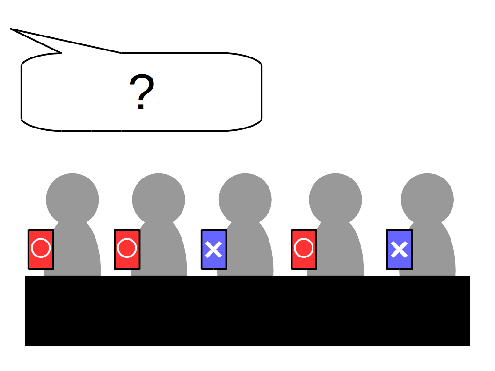

ox
==

ox is a tool to display an opinion.

## Examples

- Japanese style (default)
  - http://akiyah.github.io/ox/
  - ○ meaning "correct"
  - × meaning "wrong"
- Japanese 3 pattern
  - http://akiyah.github.io/ox/?page2=△,white,green
- Check mark / X mark
  - http://akiyah.github.io/ox/?page0=✓,green,white&page1=✗,red,white
- ? / !
  - http://akiyah.github.io/ox/?page0=!,black,yellow&page1=?,red,white
- Yes / No
  - http://akiyah.github.io/ox/?page0=Yes,white,green&page1=No,white,red

## Dependency
- [jQuery](https://github.com/jquery/jquery)
- [pagePiling.js](https://github.com/alvarotrigo/pagePiling.js)

## License
MIT

